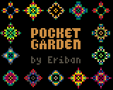
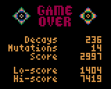

# Pocket Garden

Pocket Garden is slow-play, low-interaction, screen-saver game for the [Gamebuino][] console.

It is a game for dreamers, grinders, slackers and thinkers.

Four layers evolve independently using Conway's [Game of Life][] cellular automata rules.

Next to that, there is a background reaper process for each layer.
It randomly removes cells that have been static for too long.

There is also a background mutation process.
It randomly mutates cells, mainly to prevent that isolated gliders gain immortality.

So if you do nothing, your garden will eventually die out.
If you wish, you can every so often initiate a revive action with the A button.

The revive action will scan the entire grid.
Anywhere where there are alive cells in two neighbouring layers, new cells are sprouted in the other two layers.
Often these new cells die immediately of starvation, but sometimes they initiate a flurry of activity.
This may help your garden live a bit longer.

You can use the up and down keys to speed-up and slow-down time.
You can use the left and right keys to change the view.
There's even a fancy plot that shows how well your garden is doing.

Features
--------

- Four layers of Conway's Life running at 30 FPS
- Additional decay and mutation background processes
- Sound effects that reflect how well your garden is doing
- A plot that shows how well each layer is doing
- Revive action with light effect feedback
- Hi-score and lo-score (auto-play mode only)

Credits
-------

In order to maximise performance, the Game of Life rules are implemented by performing bitwise operations.
This is heavily inspired by [rilden's Game of Life](https://www.lexaloffle.com/bbs/?pid=94115) for [PICO-8][].

[Gamebuino]: https://gamebuino.com
[Game of Life]: https://en.wikipedia.org/wiki/Conway%27s_Game_of_Life
[PICO-8]: https://www.lexaloffle.com/pico-8.php

